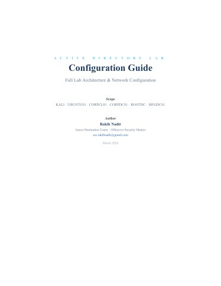
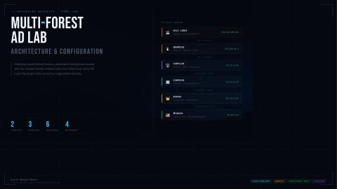
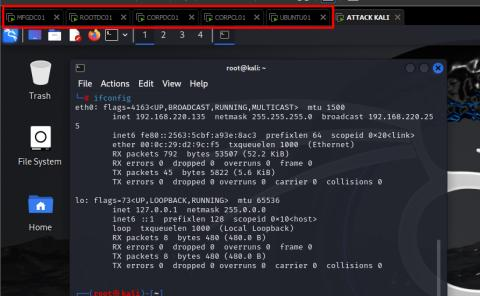
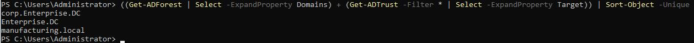
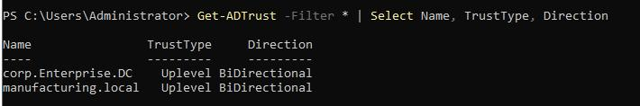
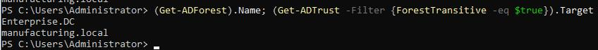

# Multi-Forest Active Directory Lab


> ⚠️ Disclaimer: This lab was built in a fully isolated local environment for
> educational and research purposes only. All attack simulations were conducted
> against self-owned, air-gapped machines with no connection to any production
> or external network.

## Overview
A fully isolated enterprise-grade Active Directory lab built across four network
segments, simulating a real-world multi-forest enterprise environment with
cross-forest trust relationships and layered network pivoting requirements.
Every configuration reflects what you would find in a real enterprise environment
— not CTF shortcuts.

## Environment Structure

| Component | Details |
|---|---|
| Primary Forest | enterprise.dc |
| Child Domain | corp.enterprise.dc |
| Secondary Forest | manufacturing.local |
| Trust Type | Bidirectional Forest Trust |
| Total Machines | 6 |
| Network Segments | 4 isolated segments |

## Attack Path
To reach the manufacturing forest from the attacker machine, you must pivot
through each layer sequentially:

```
Attacker → External → DMZ → Corporate → Manufacturing
```

This mirrors a real enterprise breach — not a direct hop.

## What Was Simulated
- Network pivoting across four fully isolated segments
- Active Directory trust relationship enumeration and abuse
- Privilege escalation across domain boundaries
- Cross-forest compromise via bidirectional forest trust
- DCSync attacks for domain credential harvesting
- Kerberoasting and AS-REP roasting across domains

## Tools Used

| Tool | Purpose |
|---|---|
| BloodHound | AD attack path enumeration |
| Impacket | Remote execution and DCSync |
| Rubeus | Kerberos ticket manipulation |
| CrackMapExec | Lateral movement and enumeration |
| Mimikatz | Credential extraction |
| Proxychains | Network pivoting |

### Configuration Guide


📄 [Download Configuration Guide](config/AD-Multi-Forest-Configuration-Guide.pdf)

## Screenshots

### Lab Overview


### Configuration Guide


### Six Machines Across Segments


### Three Domain Structure


### Two Forest Architecture


### Bidirectional Trust Configuration


## Author
**Rakib Mahmud Nadir**  
Junior Penetration Tester | Active Directory Security  
[Portfolio](https://rakibnadir33.github.io/rakibnadir.github.io/) · [LinkedIn](https://linkedin.com/in/rakib-nadir)
